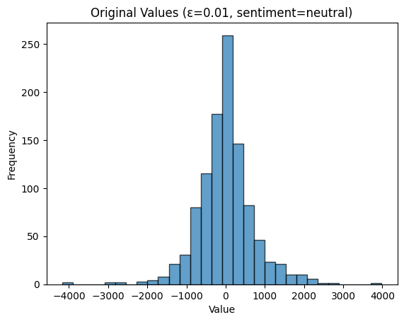
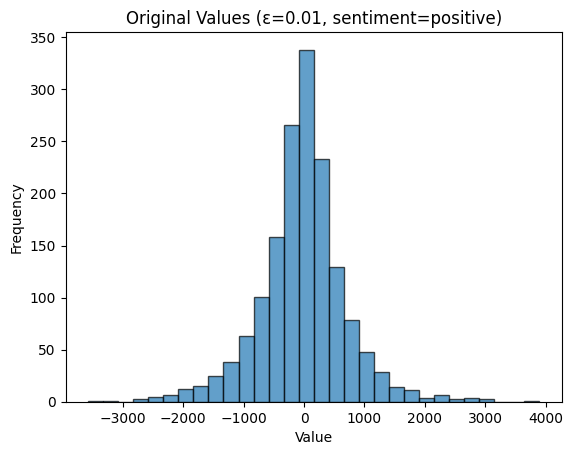
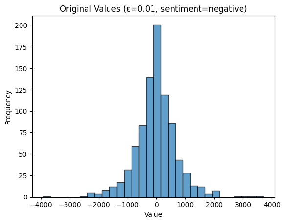
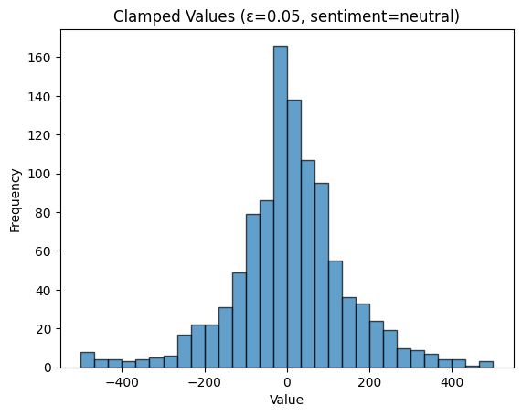
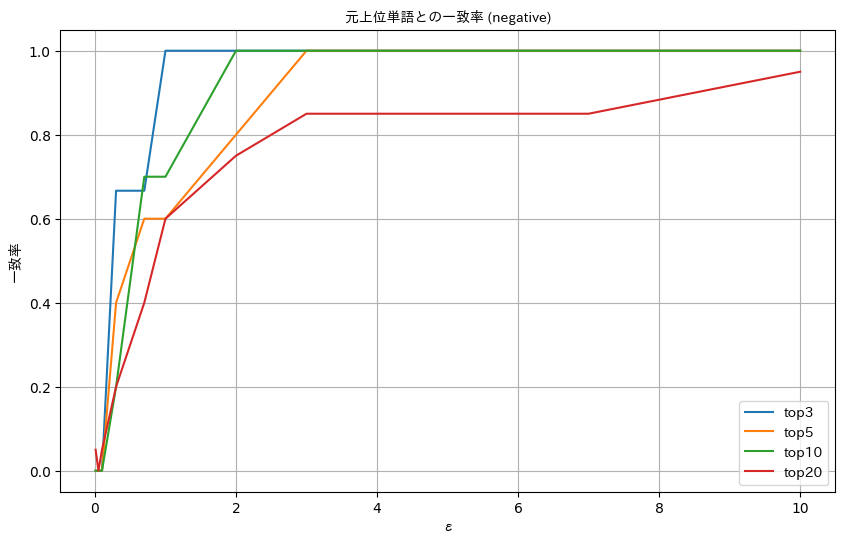
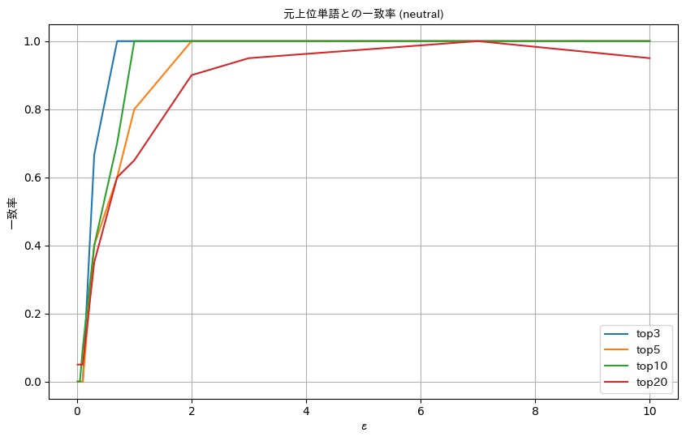
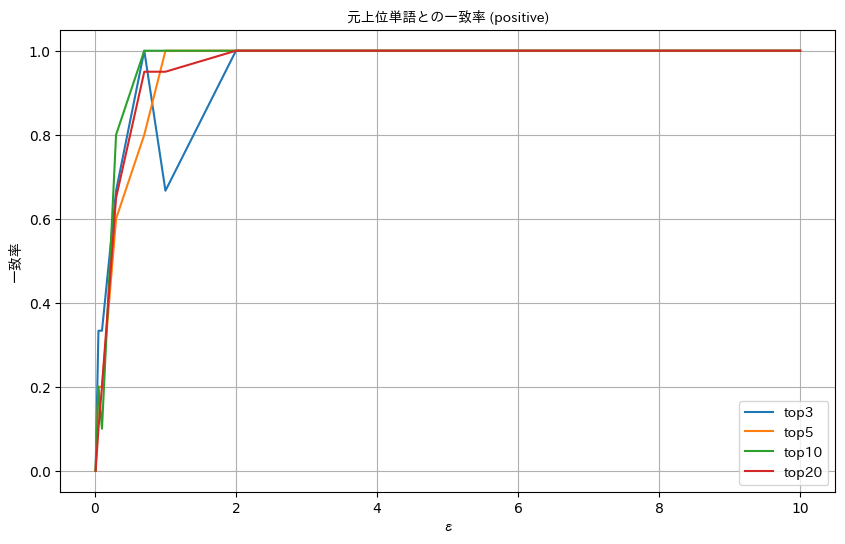
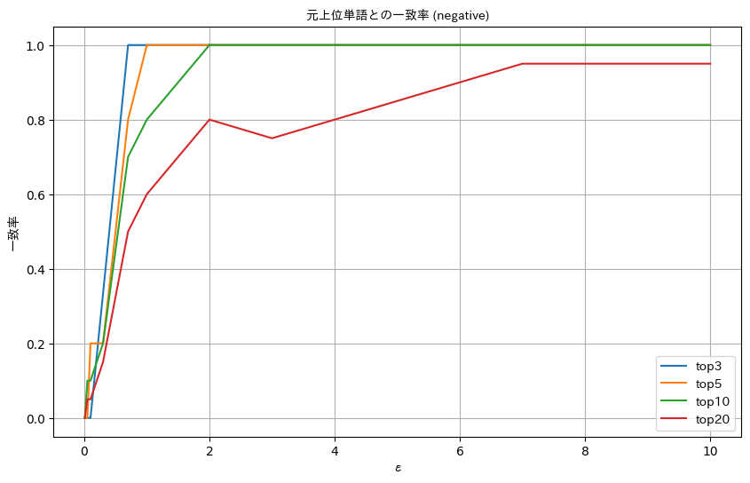
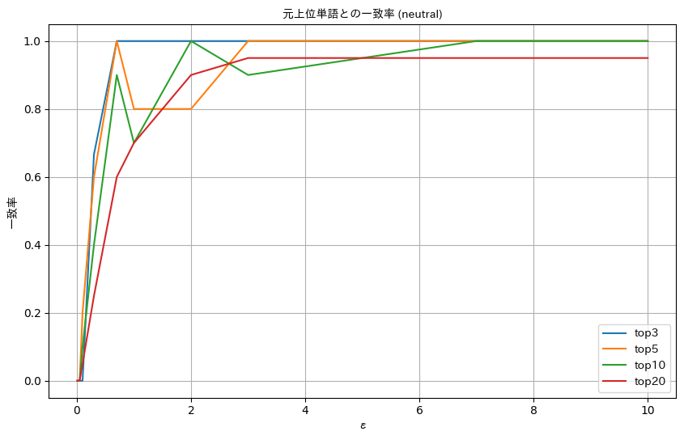
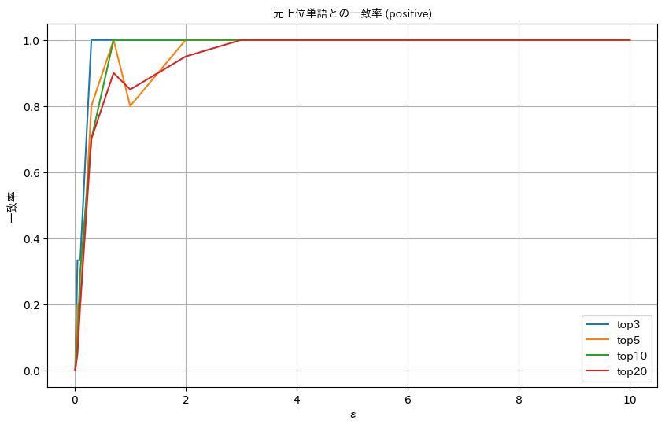

<script type="text/javascript" async src="https://cdnjs.cloudflare.com/ajax/libs/mathjax/2.7.7/MathJax.js?config=TeX-MML-AM_CHTML">
</script>
<script type="text/x-mathjax-config">
 MathJax.Hub.Config({
 tex2jax: {
 inlineMath: [['$', '$'] ],
 displayMath: [ ['$$','$$'], ["\\[","\\]"] ]
 }
 });
</script>


# 分析ケース①: 記述統計へのDP適用

## 検証内容：差分プライバシーのノイズを登場頻度上位単語が正しく出力されるか
### 1. データの前処理
データの前処理として、クチコミのテキストデータに形態素解析を行い、各クチコミをBag-of-Words（BoW）として表現
#### BoW例
- 特定の品詞（形容詞・副詞・間投詞・名詞・固有名詞・動詞）を抽出
- 抽出した単語を用いてBoWを生成し、クチコミをベクトル表現に変換  

① 「ここのスタッフは非常に親切でした。」  
②「 トイレが少し汚かったのが残念なところです。 」  
③「ここのスタッフは非常に親切でした。ただ、トイレが少し汚かったのが残念なところです。」  

という3つの文章があった場合、まずこれを単語に分割して、出現回数を計算　　
|   | ここ | スタッフ | トイレ | 非常に | 少し | 親切な | です | 汚い | 残念な |
|---|---|---|---|---|---|---|---|---|---|
| ① | 1 | 1 | 0 | 1 | 0 | 1 | 1 | 0 | 0 |
| ② | 0 | 0 | 1 | 0 | 1 | 0 | 1 | 1 | 1 |
| ③ | 1 | 1 | 1 | 1 | 1 | 1 | 2 | 1 | 1 |


<!-- #### 数式
クチコミ $d_i$に対して形態素解析を行い、単語の集合 
$T(d_i)$
を得る。
$ T(d_i) = \{ t_1, t_2, \ldots, t_n \} $
ここで、$t_i$はクチコミ $d_i$に含まれる単語です。 -->

### 2. 単語の出現頻度の計算
各クラス（positive, neutral, negative）のクチコミについて、BoWを用いて単語の出現頻度を計算

- 各クラスごとにBoWを生成し、単語の出現頻度を計算

<!-- 
 -->

- 各クラスの上位単語を抽出


<!-- #### 数式
各クラス $C_k$に対してBoWを生成し、出現頻度ベクトル $f_k$を計算  
$f_k = \left( \sum_{d_i \in C_k} \text{BoW}(d_i) \right) $ -->

### 3. 差分プライバシーの適用
Laplaceメカニズムを用いて、出現頻度にノイズを加えます。これにより、個々のクチコミデータのプライバシーを保護

- 各単語の出現頻度に対してLaplaceノイズを加える
<!-- #### 数式 -->
| rank | word | count | ε=0.01 | ε=0.05 | ε=0.1 | ε=0.3 | ε=0.7 | ε=1.0 | ε=2.0 | ε=3.0 | ε=7.0 | ε=10.0 |
|------|------|-------|--------|--------|-------|-------|-------|-------|-------|-------|-------|--------|
| 1    | 利用 | 216.0 | 3495   | 675    | 296   | 200   | 213   | 209   | 215   | 217   | 216   | 217    |
| 2    | 部屋 | 93.0  | 3107   | 607    | 266   | 106   | 80    | 97    | 93    | 86    | 93    | 93     |
| 3    | 旅行 | 67.0  | 3046   | 526    | 259   | 96    | 62    | 66    | 63    | 68    | 67    | 69     |
| 4    | ある | 60.0  | 2706   | 514    | 256   | 95    | 57    | 64    | 59    | 60    | 59    | 60     |
| 5    | 思う | 59.0  | 2686   | 490    | 255   | 93    | 55    | 57    | 57    | 57    | 55    | 59     |
| 6    | 朝食 | 50.0  | 2471   | 460    | 242   | 91    | 55    | 55    | 49    | 51    | 48    | 50     |
| 7    | 風呂 | 47.0  | 2470   | 418    | 224   | 89    | 48    | 51    | 48    | 46    | 48    | 48     |
| 8    | 普通 | 45.0  | 2345   | 417    | 216   | 81    | 47    | 43    | 46    | 44    | 45    | 45     |
| 9    | 宿泊 | 43.0  | 2302   | 410    | 209   | 78    | 45    | 37    | 45    | 42    | 42    | 43     |
| 10   | なる | 43.0  | 2284   | 406    | 207   | 77    | 43    | 34    | 44    | 42    | 42    | 42     |
| 11   | 初めて | 34.0 | 2196  | 398    | 207   | 72    | 41    | 33    | 38    | 37    | 33    | 33     |
| 12   | ホテル | 32.0 | 2164  | 392    | 204   | 70    | 40    | 32    | 33    | 35    | 31    | 33     |
| 13   | いる | 30.0  | 2120   | 389    | 199   | 69    | 40    | 31    | 30    | 33    | 31    | 30     |
| 14   | 良い | 27.0  | 2103   | 389    | 195   | 69    | 40    | 30    | 27    | 29    | 28    | 27     |
| 15   | 感じ | 27.0  | 2077   | 375    | 192   | 66    | 37    | 29    | 27    | 29    | 27    | 26     |
| 16   | 家族 | 25.0  | 2033   | 371    | 187   | 65    | 36    | 29    | 27    | 29    | 26    | 25     |
| 17   | 出張 | 25.0  | 1979   | 362    | 186   | 64    | 36    | 28    | 24    | 27    | 25    | 25     |
| 18   | 予約 | 23.0  | 1963   | 357    | 184   | 63    | 36    | 27    | 23    | 24    | 24    | 23     |
| 19   | する | 22.0  | 1922   | 346    | 181   | 62    | 34    | 26    | 23    | 22    | 22    | 23     |
| 20   | 夕食 | 21.0  | 1851   | 345    | 181   | 60    | 34    | 25    | 23    | 22    | 21    | 21     |


<!-- 出現頻度 $f_k$→出現頻度にノイズを加えた頻度 $f_k$  
$f_k' = f_k + \text{Lap}(\frac{1}{\epsilon}) $  
※$\text{Lap}(\frac{1}{\epsilon})$はスケールパラメータ $\frac{1}{\epsilon}$のLaplace分布からのサンプルです。 -->


<!-- ### 具体例と数式の説明

#### データの読み込みと形態素解析の実施
```python
df["doc"] = [nlp(review) for review in df["review"]]
```
ここでは、各クチコミに対して形態素解析を行い、形態素解析済みのクチコミを `doc` 列に格納しています。 -->

<!-- #### BoWの生成と単語の出現頻度の計算
```python
bows = {}
cvs = {}
for sentiment in df["sentiment"].unique():
    tokens = []
    for doc in df[df["sentiment"] == sentiment]["doc"]:
        similarities = [(token.similarity(doc), token.lemma_) for token in doc if token.pos_ in POS]
        similarities = remove_duplicates(similarities)
        similarities = sorted(similarities, key=lambda sim: sim[1], reverse=True)[:MAX_TERMS_IN_DOC]
        tokens.append([similaritity[1] for similaritity in similarities])
    cv = CountVectorizer(ngram_range=(1, NGRAM), max_df=MAX_DF, min_df=MIN_DF, max_features=NUM_VOCAB)
    bows[sentiment] = cv.fit_transform(flatten(tokens)).toarray()
    cvs[sentiment] = cv
```
各クラス（positive, neutral, negative）ごとにBoWを生成し、単語の出現頻度を計算しています。

#### 差分プライバシーの適用
```python
from pydp.algorithms.laplacian import Count

def preprocess_for_private_counts(tf: np.ndarray) -> List[np.ndarray]:
    repeated_words = []
    for i, term in enumerate(tf):
        repeated_words.append(np.repeat(i, term))
    return repeated_words

def cal_private_count(
    epsilon: float,
    max_partition_contributed: float,
    max_contributions_per_partition: float,
    repeated_words: List[np.ndarray],
) -> List[int]:
    private_counts = []
    for repeated_word in repeated_words:
        counter = Count(epsilon, max_partition_contributed, max_contributions_per_partition)
        count = counter.quick_result(repeated_word)
        private_counts.append(count)
    return private_counts
``` -->
## 通常の結果
ノイズを加えた単語の出現頻度を基に、上位の単語とその頻度を計算







## クランプ処理
### 目的：極端な値が推定値に大きな影響を与えるのを防ぐ  

$
推定値_{clamped} = 
\begin{cases} 
\Lambda & (推定値 > \Lambda) \\
-\Lambda & (推定値 < -\Lambda) \\
推定値 & \text{otherwise} 
\end{cases} 
$

## クランプをした結果





