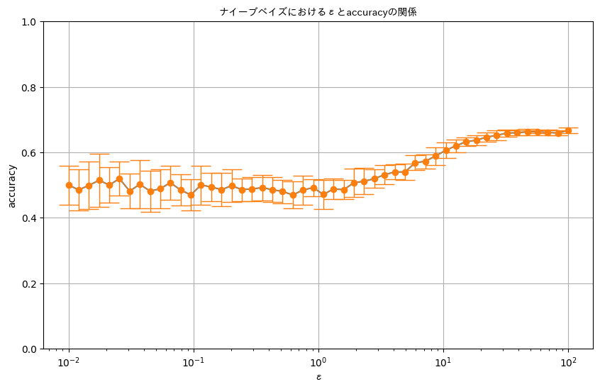
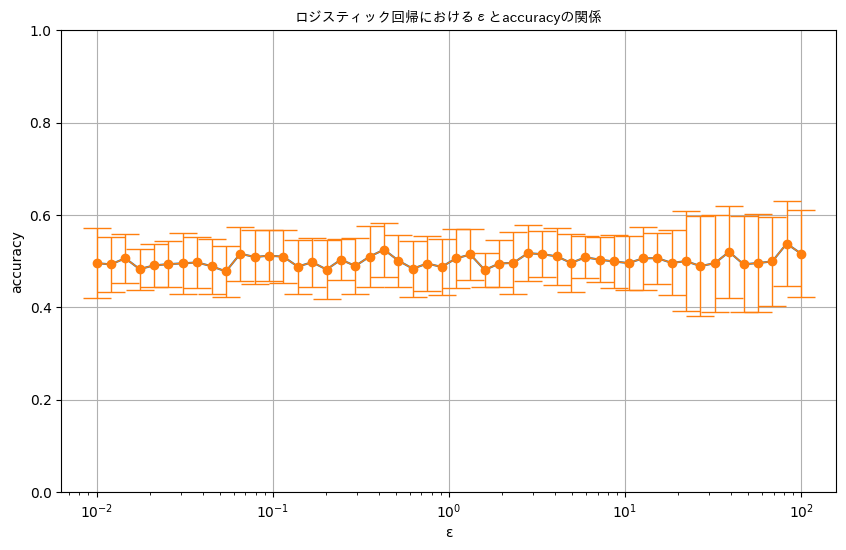
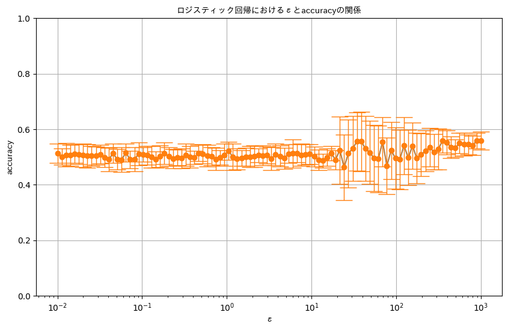

## 分析ケース②: MLアルゴリズムへの差分プライバシー適用

### 1. ボキャブラリの作成とBag-of-Words（BoW）化

クチコミのテキストデータをBag-of-Words（BoW）で特徴量を作成

- クチコミのテキストを解析して、特定の品詞（POS: 形容詞、動詞、名詞など）に該当する単語を抽出。
- 単語の類似度を計算し、重複を排除。
- 各クチコミについて、上位の単語（最大5語）を選定。で
- BoWとしてテキストデータをベクトル化（CountVectorizerを使用）。

### 2. クチコミのラベル付け

クチコミの感情（sentiment）をリピートするかしないかに基づいてラベル付けします。

- Positiveなクチコミはリピートする（1）。
- NeutralおよびNegativeなクチコミはリピートしない（0）。

### 3. データの分割

作成した特徴量とラベルを学習用データセットとテスト用データセットに分割します。`train_test_split`関数を使用して、データセットをトレーニングセット（80%）とテストセット（20%）に分割

#### 差分プライバシーなし

- 精度
- ナイーブベイズNon-DP accuracy:  0.6444644464446445

- ロジスティック回帰Non-DP accuracy:  0.7155715571557155

<!-- #### 差分プライバシーあり

- プライバシーパラメタϵを対数スケールで範囲[10^-2, 10^2]の50分割し、各ϵに対して20回ずつ精度を計算します。
- 結果として、ϵが大きいほど（ϵ ≥ 10）、精度が安定して差分プライバシーなしの精度に近づくことがわかります。 -->
#### 差分プライバシーあり

- プライバシーパラメタϵを対数スケールで範囲[10^-2, 10^2]の50分割し、各ϵに対して20回ずつ精度を計算
- ナイーブベイズはϵが大きいほど（ϵ ≥ 10）、精度が安定して差分プライバシーなしの精度に近づく
- ロジスティック回帰はうまく行かなかった

### memo

目的：クチコミデータからユーザーのリピート行動を予測  
ナイーブベイズとロジスティック回帰の機械学習アルゴリズムに差分プライバシーを適用  
ナイーブベイズでは、特徴量のカウントにノイズを加え、ロジスティック回帰では目的関数にノイズを加えています